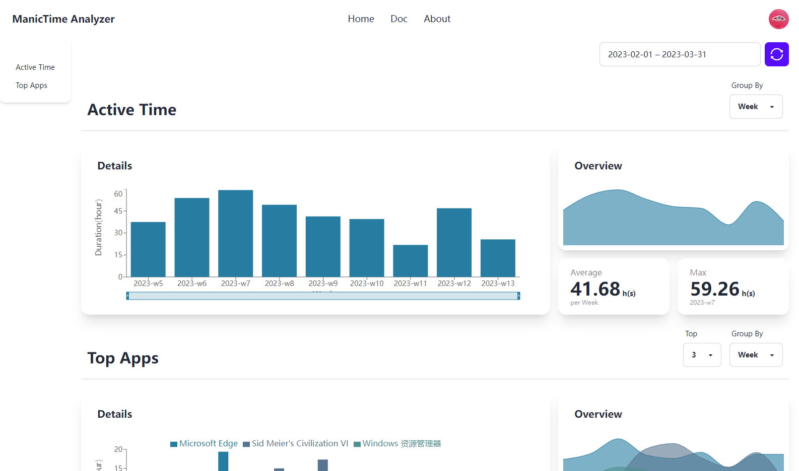

# ManicTime Analyzer

> A dashboard for ManicTime data

## 说明

一个非官方的[ManicTime](https://www.manictime.com/)分析面板。你可以导入数据，并开始在线分析。

它同时也是一个我的全栈开发练习项目，使用[Next.js](https://nextjs.org)作为前端，[FastAPI](https://fastapi.tiangolo.com/)作为后端，UI组件库使用了[daisyUI](https://daisyui.com/)，数据库使用了[MongoDB](https://www.mongodb.com/)

## Introduction

An unofficial dashboard for [ManicTime](https://www.manictime.com/). You can import data and start analyzing it online.

It is also a full-stack development practice project of mine, using [Next.js](https://nextjs.org) for the front end, [FastAPI](https://fastapi.tiangolo.com/) for the back end, using [daisyUI](https://daisyui.com/) UI component library, using [MongoDB](https://www.mongodb.com/) as the database.

